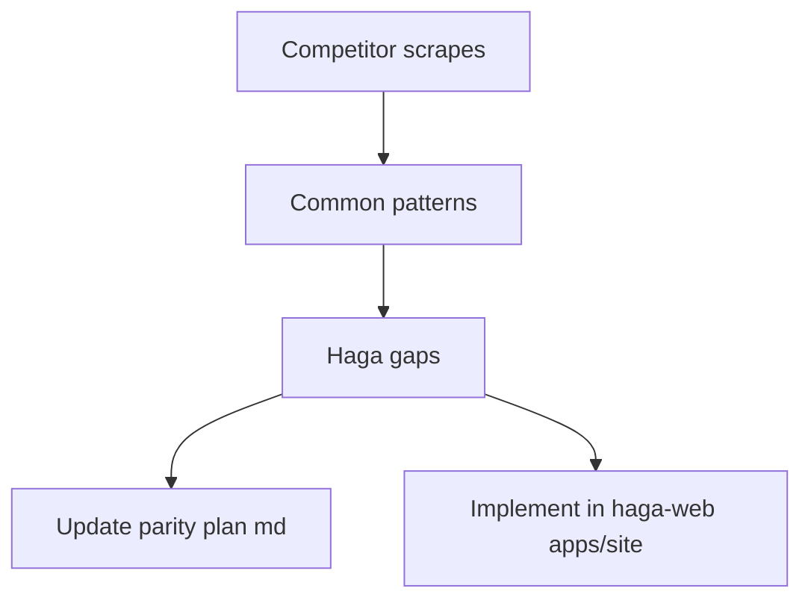

# Haga Site Parity from Competitor Analysis

## What competitors share (from scrapes)

Across Antioch, Bifrost, Drift, and RoboCurve (Sim2Real is lander-only), sites converge on one story:

> Physical AI is arriving → evaluation is the bottleneck → we make failure discovery fast/credible → dual path: self-serve evidence + high-touch demo/eval.

| Shared pattern | Evidence | Haga today |
|---|---|---|
| Numbered how-it-works (3–5 steps) | Antioch 5-step; Bifrost 3-step; Drift 3-step | Missing |
| Dual CTA (product + sales) | Get Started / Book Demo; Lab / Talk | Present (`Get an eval` + `Open the lab`) |
| Interactive product/evidence surface | Pass-rate UI, CLI, scorecards | Strong on `/lab/[slug]`; hub is cards-only |
| About / founder credibility | Drift `/team`; RoboCurve About | Inline `Team` only |
| FAQ | Drift home (13); Bifrost `/robotics` | Missing |
| First-party blog + clean sitemap | Antioch/Bifrost/Drift enumerate real posts | External bridge; **ghost** `/blog/...` in [sitemap.ts](file:///Users/mushood/Documents/code/haga/haga-web/apps/site/app/sitemap.ts) |
| Keyword cluster: physical AI, evaluation, failure modes, sim-to-real | Titles/H1s across all commercial peers | Present in tagline; underused in IA/FAQ/blog |
| Privacy/Terms | Antioch, Drift | Missing |
| Logo wall / press / careers | Funded peers | Nice-to-have — skip (no assets yet) |

**Closest narrative peer:** RoboCurve (independent, real-world, verifiable). **Closest conversion peers:** Drift + Bifrost (FAQ + dual CTA + blog SEO).

Haga’s unfair advantage already shipped: Lab + Methodology + Article + metrics SSOT (`@haga/metrics`). Gaps are corporate trust pages, homepage flow, hub proof, and SEO hygiene — not product depth.

## Deliverable A — Rewrite the vault plan

Replace content of [haga-vs-competitors-site-parity-plan.md](03-resources/competitors/haga-vs-competitors-site-parity-plan.md) with:

1. **Commonality matrix** (pages, SEO, homepage sections, product display, data/proof, trust, CTAs, blog)
2. **Haga delta table** (current vs must-have)
3. **Prioritized build plan** (Phase 1 = this pass; Phase 2 = later)
4. **Copy/keyword guidance** aligned to competitor vocabulary without copying sim-platform claims (keep independent-verification wedge)

Keep frontmatter todos synced to Phase 1 items below.

## Deliverable B — Implement in `/Users/mushood/Documents/code/haga/haga-web/apps/site`

Repo: `haga-web` → `apps/site`. Data pattern: `lib/*-data.ts` + `app/<route>/page.tsx` + register in `nav` ([landing-data.ts](file:///Users/mushood/Documents/code/haga/haga-web/apps/site/lib/landing-data.ts)) and [sitemap.ts](file:///Users/mushood/Documents/code/haga/haga-web/apps/site/app/sitemap.ts).

### Phase 1 — Outreach MVP (implement now)

**1. Homepage how-it-works + CTA polish**
- Add `howItWorks` (5 steps: Problem → Method → Evidence → Outcome → CTA) in `landing-data.ts`
- New `components/how-it-works.tsx`; insert in [app/page.tsx](file:///Users/mushood/Documents/code/haga/haga-web/apps/site/app/page.tsx) after Hero, before Problem
- Primary CTA label → **Request eval** (href stays `/#contact`); secondary stays **Open the lab**
- Soften metadata/tagline toward competitor phrasing: “Independent verification for physical AI” without rewriting Problem/Vision/Market bodies

**2. `/about`**
- `app/about/page.tsx` + `lib/about-data.ts`
- Expand existing `team` facts: founder, why verification (not another sim platform), mission, CTAs to `/lab` and `/#contact`
- Add to nav + sitemap + footer (footer already shares `nav`)

**3. First-party blog + sitemap hygiene**
- On-site post route (Physics-IQ / CogVideoX breakdown using Lab numbers already public)
- Refactor blog index to `lib/blog-data.ts`: first-party post + existing mushoodhanif.com outbound links
- Fix sitemap: remove ghost `/blog/...` URLs; add real routes (`/about`, `/faq`, on-site post, `/article/...`, `/methodology`, `/demo`, `/lab` + slugs). Do not invent press/careers URLs

**4. `/lab` hub interactive evidence**
- Extend [lab-hub.tsx](file:///Users/mushood/Documents/code/haga/haga-web/apps/site/components/lab-hub.tsx): featured chart above cards (Lift stress or Physics-IQ vs CogVideoX) via existing chart primitives + `@haga/metrics`
- Compact world-model flag callout (`static_hover` 0% → 100%) linking to `/lab/physicsiq`
- No new metrics pipeline

**5. `/faq`**
- `app/faq/page.tsx` + `lib/faq-data.ts` (~10 Qs): vs sim platforms, accepted artifacts, SLA, sim-only limits, methodology links, pilot framing, solo-founder credibility, privacy of private evals
- Seed answers with keywords peers own: physical AI, evaluation, failure modes, sim-to-real, independent/reproducible
- Nav + sitemap

**6. Privacy + Terms stubs (outreach/enterprise trust)**
- Minimal `/privacy` and `/terms` pages (competitors treat these as table stakes for forms)
- Footer links; low sitemap priority (`0.3`)
- Short, accurate copy — no fake legal firm claims

### Phase 2 — Explicitly deferred (document only in parity md)

Logo wall, careers, press, vertical solution pages, docs AI, testimonials, high-cadence product blog, `llms.txt` / AI-train robots policy. Revisit when logos/press/hiring exist.

## Vault sync after ship

Update [haga-web-site.md](01-projects/haga-web-site.md) Step status for site-parity MVP when deployed.

## Done when

- Parity plan md reflects full commonality analysis + Phase 1/2 split
- `/about`, `/faq`, `/privacy`, `/terms`, and one on-site `/blog/...` resolve
- Homepage shows 5-step flow + dual CTAs
- `/lab` hub shows featured chart + WM flag callout
- Sitemap lists only real haga routes
- Nav exposes About + FAQ (Blog/Lab already present)
