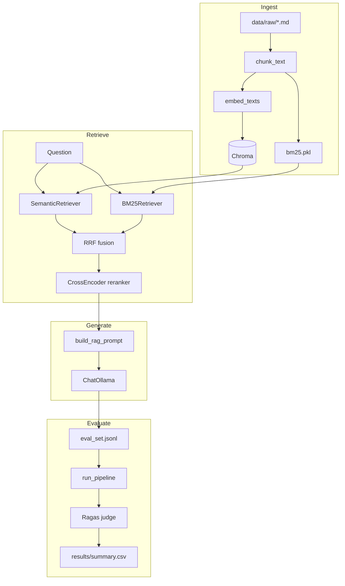

# RAG Pipeline with Evaluation Harness

A self-hosted Retrieval-Augmented Generation (RAG) pipeline over a curated Wikipedia corpus. It ingests 20 NLP/RAG articles, indexes them with semantic and keyword search, reranks candidates with a cross-encoder, generates grounded answers with **Ollama**, and benchmarks quality with **Ragas**.

---

## Table of Contents

- [What This Project Does](#what-this-project-does)
- [How It Works](#how-it-works)
- [Prerequisites](#prerequisites)
- [Quick Start](#quick-start)
- [Running the Pipeline](#running-the-pipeline)
- [What to Look For](#what-to-look-for)
- [Project Structure](#project-structure)
- [Configuration](#configuration)
- [Development](#development)
- [Troubleshooting](#troubleshooting)
- [License](#license)

---

## What This Project Does

| Layer | Implementation |
|-------|----------------|
| Corpus | 20 English Wikipedia articles on RAG, NLP, and retrieval |
| Ingestion | Fixed-size chunking → `sentence-transformers` embeddings → Chroma + BM25 index |
| Retrieval | Semantic (Chroma), keyword (BM25), or hybrid (RRF merge) |
| Reranking | Cross-encoder (`cross-encoder/ms-marco-MiniLM-L-6-v2`) |
| Generation | Ollama via LangChain (`langchain-ollama`) |
| Evaluation | Ragas metrics scored with the same Ollama model |
| Demo | Gradio UI for Q&A and viewing benchmark history |

**Entry points:**

| Command | Purpose |
|---------|---------|
| `python -m src.ingest` | Chunk, embed, and index the corpus |
| `python -m src.query` | Ask a question from the terminal |
| `python -m src.evaluate` | Run the full pipeline on an eval set and score with Ragas |
| `python -m src.demo` | Web UI for questions + evaluation results |

---

## How It Works



### Ingestion (`src/ingest.py`)

1. Loads markdown articles from `data/raw/`.
2. Splits each article into overlapping character chunks (`CHUNK_SIZE` / `CHUNK_OVERLAP`).
3. Writes chunks to `data/processed/chunks.jsonl`.
4. Embeds all chunks and upserts them into a remote Chroma collection.
5. Builds and saves a BM25 index to `data/index/bm25.pkl`.

### Retrieval modes (`src/pipeline.py`)

All query paths go through `run_pipeline(question, mode, ...)`:

| Mode | Behavior |
|------|----------|
| `semantic` | Chroma vector search only |
| `hybrid` | Semantic + BM25 in parallel, merged with weighted reciprocal rank fusion (`HYBRID_ALPHA`) |
| `hybrid_rerank` | Hybrid retrieval, then cross-encoder reranking to `RERANK_TOP_K` chunks |

After retrieval, the pipeline optionally calls Ollama with a grounded prompt (`src/llm.py`) that includes numbered context chunks and instructs the model to answer only from context.

### Evaluation (`src/evaluate.py`)

For each row in `data/eval/eval_set.jsonl`:

1. Runs `run_pipeline` with the chosen mode.
2. Collects the generated answer and retrieved contexts.
3. Scores with Ragas: **faithfulness**, **answer relevancy**, **context precision**.
4. Writes a per-run CSV and appends aggregate scores to `results/summary.csv`.

The Gradio demo reads `results/summary.csv` on the **Evaluation results** tab — no separate results file in the repo root.

---

## Prerequisites

| Requirement | Notes |
|-------------|-------|
| Python 3.11+ | 3.12 recommended |
| [Ollama](https://ollama.com/) | Answer generation and Ragas judging (`http://localhost:11434`) |
| [Chroma](https://docs.trychroma.com/) | Vector store (`http://localhost:8000`) |
| ~2 GB disk | Models + index |
| 8–16 GB RAM | Embeddings, reranker, and Ollama |

```bash
# Start Chroma
docker run -p 8000:8000 chromadb/chroma

# Pull the default model
ollama pull qwen3:8b
```

---

## Quick Start

```bash
git clone https://github.com/<your-username>/rpeh.git
cd rpeh

python3.12 -m venv .venv
source .venv/bin/activate

pip install --upgrade pip
pip install -r requirements.txt

cp .env.example .env
# Edit .env if Ollama or Chroma endpoints differ

python scripts/download_wikipedia_corpus.py
python -m src.ingest --input data/raw --output data/index --force

python -m src.query "What is retrieval-augmented generation?"
python -m src.demo
```

---

## Running the Pipeline

### Ingest / re-index

```bash
python scripts/download_wikipedia_corpus.py
python -m src.ingest --input data/raw --output data/index
python -m src.ingest --input data/raw --output data/index --force   # rebuild Chroma collection
python -m src.ingest --chunk-size 256 --chunk-overlap 32            # chunking experiment
```

### Query from the terminal

```bash
# Default: hybrid retrieval + rerank + Ollama answer
python -m src.query "What is Okapi BM25?"

# Compare retrieval strategies
python -m src.query "What is Okapi BM25?" --mode semantic --no-llm
python -m src.query "What is Okapi BM25?" --mode hybrid --no-rerank
python -m src.query "What is Okapi BM25?" --mode hybrid_rerank

# Retrieval only (inspect chunks without calling Ollama)
python -m src.query "What is a transformer?" --no-llm --top-k 5
```

### Batch evaluation

```bash
python -m src.evaluate \
  --eval-set data/eval/eval_set.jsonl \
  --mode hybrid_rerank \
  --output results/run_001.csv

# Default: score first 5 rows (~1h on local qwen3:8b). Use 0 for the full eval set:
python -m src.evaluate --max-samples 0 --output results/run_full.csv

# If Ragas scoring fails after pipeline questions finish, retry scoring only:
python -m src.evaluate --skip-pipeline --output results/run_001.csv
```

Ragas prints per-row progress (`[1/5] question…` plus each metric score and elapsed seconds). It uses Ollama as the judge with `--ragas-workers 1` (default) so only one metric call runs at a time.

### Gradio demo

```bash
python -m src.demo
# Opens http://127.0.0.1:7860
```

- **Ask tab** — question input, retrieval mode selector, optional LLM toggle, answer + source chunks with scores.
- **Evaluation results tab** — table from `results/summary.csv`; click **Refresh results** after a new eval run.

---

## What to Look For

### Retrieval quality (before blaming the LLM)

1. Run with `--no-llm` and inspect whether the right source article appears in the top chunks.
2. Keyword-heavy questions (e.g. *"What is Okapi BM25?"*) should rank `okapi_bm25.md` higher under `hybrid` or `hybrid_rerank` than under `semantic` alone.
3. Conceptual questions (e.g. *"How does RAG reduce hallucination?"*) should still retrieve relevant chunks under any mode — hybrid + rerank usually tightens the top 5.

### Answer quality

- Answers should cite concepts present in the retrieved chunks, not invent facts.
- If the corpus does not contain the answer, Ollama should say it cannot answer from context.

### Evaluation metrics (Ragas)

| Metric | What it tells you |
|--------|-------------------|
| **Faithfulness** | Is the answer grounded in retrieved context? |
| **Answer relevancy** | Does the answer address the question? |
| **Context precision** | Are the retrieved chunks relevant? |

After running eval for multiple modes, compare rows in `results/summary.csv` (or the Gradio **Evaluation results** tab). Expect `hybrid_rerank` to beat `semantic` on keyword-heavy eval questions if retrieval is tuned well.

### Chunking experiments

Re-ingest with different `CHUNK_SIZE` values, re-run eval, and compare `chunk_size` columns in the summary table:

- **Smaller chunks (256)** — better precision for factual lookups.
- **Larger chunks (1024)** — more context per chunk, useful for multi-sentence answers.

---

## Project Structure

```
rpeh/
├── README.md
├── requirements.txt
├── pyproject.toml
├── .env.example
│
├── data/
│   ├── raw/                  # Wikipedia markdown + manifest.jsonl
│   ├── processed/            # chunks.jsonl (generated by ingest)
│   ├── index/                # bm25.pkl (generated by ingest)
│   └── eval/
│       └── eval_set.jsonl    # Ground-truth Q&A for benchmarking
│
├── src/
│   ├── config.py             # Settings from .env
│   ├── types.py              # RetrievalResult, PipelineResult
│   ├── embeddings.py         # sentence-transformers helpers
│   ├── chunks.py             # Load chunks.jsonl
│   ├── llm.py                # Ollama chat model + RAG prompt
│   ├── pipeline.py           # Shared retrieval + generation
│   ├── ingest.py             # Chunk, embed, index
│   ├── retrievers/
│   │   ├── semantic.py       # Chroma vector search
│   │   ├── bm25.py           # Okapi BM25 search
│   │   └── hybrid.py         # RRF merge
│   ├── reranker.py           # Cross-encoder reranking
│   ├── query.py              # CLI for Q&A
│   ├── evaluate.py           # Ragas evaluation harness
│   └── demo.py               # Gradio UI
│
├── scripts/
│   ├── download_wikipedia_corpus.py
│   └── build_eval_set_template.py
│
├── tests/                    # Unit tests (no Chroma/Ollama required)
└── results/                  # Eval CSVs + summary.csv (gitignored)
```

---

## Configuration

Copy `.env.example` to `.env`. Key variables:

| Variable | Description | Default |
|----------|-------------|---------|
| `OLLAMA_BASE_URL` | Ollama API | `http://localhost:11434` |
| `OLLAMA_MODEL` | Model for answers | `qwen3:8b` |
| `EMBEDDING_MODEL` | sentence-transformers model | `sentence-transformers/all-MiniLM-L6-v2` |
| `HF_TOKEN` | Hugging Face access token (higher rate limits, faster downloads) | _(unset)_ |
| `CHROMA_URL` | Full Chroma URL (overrides host/port/ssl) | _(unset — use host/port)_ |
| `CHROMA_HOST` / `CHROMA_PORT` / `CHROMA_SSL` | Chroma server (if `CHROMA_URL` unset) | `localhost` / `8000` / `false` |
| `COLLECTION_NAME` | Chroma collection | `rpeh_docs` |
| `INDEX_PATH` | BM25 artifact directory | `data/index` |
| `CHUNK_SIZE` / `CHUNK_OVERLAP` | Chunking | `512` / `64` |
| `TOP_K` / `RERANK_TOP_K` | Retrieve / keep after rerank | `10` / `5` |
| `HYBRID_ALPHA` | Semantic weight in RRF (1−α = BM25) | `0.5` |
| `RERANKER_MODEL` | Cross-encoder model | `cross-encoder/ms-marco-MiniLM-L-6-v2` |
| `RAGAS_LLM_MODEL` | Ollama model for Ragas judging | `qwen3:8b` |
| `EVAL_OUTPUT_DIR` | Eval CSV output directory | `results/` |
| `GRADIO_SERVER_NAME` / `GRADIO_SERVER_PORT` | Demo bind address | `127.0.0.1` / `7860` |

All LLM usage is **Ollama only** — there are no OpenAI or Anthropic dependencies.

---

## Development

```bash
source .venv/bin/activate

ruff check src/ tests/ scripts/
ruff format src/ tests/ scripts/

pytest tests/ -v
```

Tests cover chunking boundaries, RRF merge logic, and eval JSONL validation without downloading models or connecting to Chroma/Ollama.

---

## Troubleshooting

**`ModuleNotFoundError: No module named 'src'`** — Run from the repo root with the venv activated.

**Chroma connection refused** — Your `.env` is probably still pointing at `localhost:8000`. For a remote HTTPS server, set:

```bash
CHROMA_URL=https://chroma.sv.mushoodhanif.com
```

Or separately: `CHROMA_HOST=chroma.sv.mushoodhanif.com`, `CHROMA_PORT=443`, `CHROMA_SSL=true`.

After editing `.env`, re-run ingest. If you changed settings in the same shell session, restart the shell (settings are cached).

**Ollama model not found** — `ollama pull qwen3:8b`

**Empty retrieval results** — Download and ingest the corpus:

```bash
python scripts/download_wikipedia_corpus.py
python -m src.ingest --input data/raw --output data/index --force
```

**No rows on the Evaluation results tab** — Run `python -m src.evaluate` at least once, then click **Refresh results** in the demo.

**Poor retrieval** — Inspect `data/processed/chunks.jsonl`, try smaller `CHUNK_SIZE`, and compare `--mode semantic` vs `--mode hybrid_rerank` with `--no-llm` before tuning prompts.

**Slow evaluation** — Ragas makes many Ollama calls per row. Default `--max-samples 5` targets ~1 hour on local `qwen3:8b`; use `--max-samples 0` for the full set. Per-row progress is printed to the terminal.

**Hugging Face Hub rate-limit warning** — If you see `You are sending unauthenticated requests to the HF Hub`, create a [read token](https://huggingface.co/settings/tokens) and add it to `.env`:

```bash
HF_TOKEN=hf_xxxxxxxxxxxxxxxxxxxxxxxx
```

Restart the command (settings are cached). The token is optional for public models but improves download speed and rate limits.

---

## License

[GNU General Public License v3.0](LICENSE)

## Related

- Hugging Face Space: [[03-resources/social-profiles/HuggingFace|HuggingFace — divinedemon97/rpeh]]
- Skills: [[03-resources/skills-matrix/skills-overview|Skills Matrix]]
- Resume: [[03-resources/resumes/resume-ai-engineer|Resume — AI Engineer]]
- Index: [[03-resources/github-repos/github-overview|GitHub Repos]]
