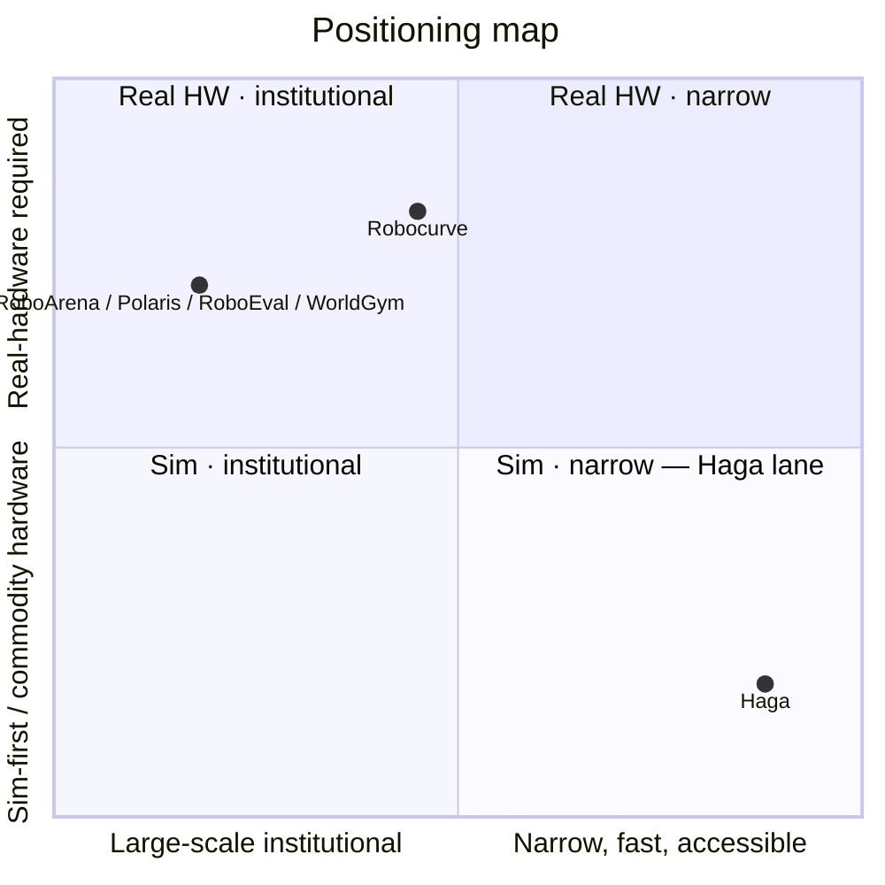

# Haga — Comprehensive Lead Generation Notes
*For AI agents finding investors, design partners, and customers*

---

## 1. COMPANY IDENTITY & POSITIONING

### What Haga Is
**Independent, adversarial, physics-grounded verification layer for physical AI** — a service that stress-tests both:
1. **Robot policies** in simulation (Pillar 1)
2. **Generative world-model outputs** (video/environments) (Pillar 2)

### What Haga Is NOT
- ❌ World-model builder or robot manufacturer
- ❌ Simulation platform (Antioch/Bifrost territory)
- ❌ Training-loop optimizer (Sim2Real territory)
- ❌ Public leaderboard (RoboArena) or real-hardware substitute (Robocurve)
- ❌ Free private evaluation service

### Locked Wedge (One-Line Positioning)
> **Fast, private, sim-first physics verification for robot policies and generative world-model outputs — not a public leaderboard, not a sim platform, not a training loop.**

### Brand Origin
Inspired by **Makoto Haga** from *Quality Assurance in Another World* — a QA tester who probes simulated worlds for bugs, exploits, and broken physics instead of accepting them as sacred lore.

**Tone:** *Independent verification over faith — stress-test, break, report.*

---

## 2. TECHNICAL ARCHITECTURE (PILLARS)

### Pillar 1 — Policy Stress Testing
| Aspect | Details |
|--------|---------|
| **Framework** | Robosuite on MuJoCo |
| **Robot/Controller** | Panda · OSC_POSE (scripted baselines) |
| **Tasks** | Lift, Stack, PickPlaceCan, Door |
| **Episodes** | 50 per condition · paired seeds 0..49 · Wilson 95% CIs |
| **Stressors** | Object mass ±50%, friction 0.5×–2.0×, actuator delay 100ms |
| **Tiers** | `mild` (gate), `moderate`, `severe` — independent RNG per tier |
| **Gate (Lift/Stack/PickPlaceCan)** | Success ratio ≥ 0.80× nominal AND grasp-fail increase ≤ 0.15 |
| **Gate (Door)** | Success-primary (grasp undefined for rotating handle) |

**Public Results (as of July 2026):**
| Task | Nominal → Severe | Mild Gate | Severe Failure Mode |
|------|------------------|-----------|---------------------|
| Lift | **1.00 → 0.26** | PASS | Grasp slip **74%** |
| Stack | **0.96 → 0.20** | PASS | Grasp fail **80%** |
| PickPlaceCan | **1.00 → 0.24** | PASS | Grasp slip **76%** |
| Door | **0.60 → 0.52** | PASS (success-primary) | Door did not open **48%** |

### Pillar 2 — Physics-Consistency Checker
| Aspect | Details |
|--------|---------|
| **Detectors** | Position-only: permanence, ballistic, contact, static_hover |
| **Calibration** | MuJoCo ground truth — Recall 1.000, FPR 0.000 |
| **Video Pipeline** | RGB → CoTracker3 → VIDEO_CHECKS (relaxed + static_hover) |
| **CogVideoX Discovery** | n=6, seeds 0–1, all fire `static_hover` (post-hoc) |
| **CogVideoX Held-out v1** | n=9, seeds 2–4, flag 1.000, Wilson [0.701, 1.000], all `static_hover` |
| **Real Physics-IQ Control** | Flag rate 0.000 |

### CLI Commands
- `haga-benchmark` — Run Pillar 1 stress benchmark
- `haga-worldmodel` — Run Pillar 2 checker calibration
- `haga-physicsiq` — Score Physics-IQ / CogVideoX videos
- `haga-publish-public` — Sanitize → schema-versioned public JSON

### Data Flow
```
Raw runs (results/) → haga-publish-public → artifacts/public/metrics/*.json + digest.json + manifest.json
→ GitHub Release tag `metrics-latest` → @haga/metrics client → apps/site LabHub + apps/dataroom EvidenceCharts
```

---

## 3. BUSINESS MODEL & GO-TO-MARKET

### Product Motions (Today → Roadmap)
| Motion | Pillar | Availability |
|--------|--------|--------------|
| Policy stress evaluation | 1 | Live: Lift + Stack + PickPlaceCan + Door tiered stress (n=50×4) |
| World-model physics QA | 2 | Checker calibrated; CogVideoX `static_hover` failure documented |
| Public-artifact paid audit (survival) | 2 | Fixed-scope ≤6 public clips, ≤5 business days |
| Continuous scoring | Both | Phase 5 — release-pipeline integration |

### What Customers Buy
- Numeric report with defined pass/fail thresholds
- **Shown failure cases (not only passes)**
- Episode counts, seeds, variance / confidence intervals
- Explicit **sim-only** limitations stated alongside results
- Optional tier comparison (mild / moderate / severe)
- **Branded delivery** — engagement metadata + methodology appendix

### Engagement Shape
1. **Intake** — artifact type, timeline, company (site form; 48h ack SLA)
2. **Scope call** — tasks, episode budget, success criteria (scope sheet locked)
3. **Run** — reproducible config logged in core (customer-private under `results/private/`)
4. **Report** — branded markdown + engagement.json (findings + failure cases + limitations + methodology appendix)
5. **Optional follow-on** — re-run on next policy version or expanded task set

### Pricing Hypotheses (Internal — Not External Until Validated)
| Motion | Price Posture | Notes |
|--------|---------------|-------|
| Pilot evaluation | Fixed-scope project fee | One policy or one world-model batch; defined episode budget |
| Repeat / multi-policy batch | Discounted package | Same harness, multiple artifacts or versions |
| Continuous scoring (Phase 5) | Subscription | Release-pipeline integration; re-baseline fees if thresholds change |

**Working ASP (TAM/SAM/SOM modeling):**
- Single scoped pilot: **$12k** (one-time)
- Near-term blended annual (1–2 pilots / light retainer): **$18k** (SAM)
- Mature recurring (multi-eval or continuous): **$36k** ACV (TAM)
- Continuous scoring (Phase 5 upside): $48k–$96k

**Anchors (Adjacent, Not Comps):**
- Sim2Real public pilots: $499–$2,500/mo (~$6k–$30k ARR) — proves WTP for sim-to-real tooling
- Patronus / enterprise eval vendors: Verification layers support enterprise ACV once trust established
- Academic benchmarks (free): Institutional trust can be free; Haga sells **speed + private engagement**

---

## 4. MARKET SIZING (Bottoms-Up, Not Top-Down CAGR)

### Headline (Base Case)
| Layer | Definition | Accounts | Working ASP/ACV | Annual $ |
|-------|------------|----------|-----------------|----------|
| **TAM** | Global spend for third-party verification of robot policies AND physics QA of generative/synthetic physical worlds | ~1,080 | $36k mature recurring | **~$39M** |
| **SAM** | Reachable ICP for current product (sim-first, private eval, NA/EU-primary GTM) | ~430 | $18k near-term blended | **~$8M** |
| **SOM** | Year-3 obtainable revenue at five-person team capacity | ~25–35 won accounts | $25k blended | **~$0.8M** |

### Buyer Universe Construction
**Pillar 1 (Policy/Manipulation) — ~930 accounts:**
- VC-backed physical-AI orgs with ML policies: **380** (~45-50% of ~800 funded)
- University + corporate robot-learning labs: **150**
- Enterprise robotics groups needing validation (later): **400**

**Pillar 2 (World-Model/Synthetic) — ~180 unique buyers:**
- Pure-play world-model financings (24mo): **23** companies / $5.88B
- Synthetic-data generation: **~60-63** companies
- China embodied-data: **97** (light TAM weight, out of v0 SAM)
- Adjacent generators (no "WM" label): **+80**

**Dedup overlap: ~30 → TAM ≈ 1,080 accounts**

### SAM Filters (Judgment on Counted Proxies)
- Sim-first private eval (pre-Robocurve/pre-RoboArena)
- Seed → growth startups + buyable labs
- NA / EU / UK / Canada / ANZ primary
- Exclude enterprise continuous-compliance until Phase 5

**SAM Segments: Policy startups 280 + WM/synthetic builders 90 + Buyable labs 60 = ~430**

### SOM (Capacity-Bound, Not % of SAM)
| Year | Won Accounts (cum.) | Blended $/account | Year Revenue |
|------|---------------------|-------------------|--------------|
| 1 | 5–8 pilots | $12k | ~$60k–$100k |
| 2 | 15–20 | $18k | ~$270k–$360k |
| 3 | 25–35 | $25k | **~$0.6M–$0.9M** |

---

## 5. IDEAL CUSTOMER PROFILE (ICP)

### Primary ICPs
| ICP | Pain | Trigger | Offer |
|-----|------|---------|-------|
| **Robot policy teams** (labs/startups) | Self-reported sim benchmarks don't survive deployment; institutional leaderboards too heavy | Pre-hardware trial, pre-RoboArena/Robocurve spend, investor diligence | Pillar 1 stress report with tiers, CIs, shown failure modes |
| **World-model / synthetic-data builders** | Generated environments/video encode impossible physics; buyers ask for QA they cannot self-certify | Dataset release, model drop, enterprise pilot requiring physics plausibility | Pillar 2 physics-consistency scoring on trajectories / tracked video |
| **Enterprise robotics groups** (later) | Compliance/insurance documentation (ANSI/A3-adjacent) | Production rollout, insurer/customer audit ask | Continuous scoring in release pipeline (Phase 5) |

### Buying Committee
| Role | Cares About |
|------|-------------|
| Technical lead / research engineer | Methodology rigor, failure cases, reproducibility |
| Founder / PM | Turnaround time, cost vs building in-house |
| Compliance / ops (enterprise) | Documented thresholds, audit trail |

### Disqualification Signals
- Wants "PASS badge" without failure cases or CIs
- Requires Cosmos-class scores not yet published
- Expects open-source harness as the deliverable
- China-only GTM for v0

### Not Buyers (Competitors/Adjacent)
- **Robocurve, Instance** — complementary positioning only; do not put on customer pipeline
- **Antioch / Bifrost** — channel watchlist (sell through them later)
- Simulation-platform buyers — partners, not customers

---

## 6. COMPETITIVE LANDSCAPE (Tiered)

### Tier 0 — Institutional/Academic Benchmarks (Credibility Ceiling)
| Initiative | Backers | Threat | Relationship |
|------------|---------|--------|--------------|
| **RoboArena** | NVIDIA, Stanford, UC Berkeley | **High** — real, contested, free, credible leaderboard | Different tier: institutional, real-robot, not fast-turnaround commercial service |
| **WorldArena/WorldScore** | Multi-lab consortium | Medium-High | Different target: world-model generation quality |
| **RoboEval, Polaris, RoboDojo, WorldGym, SC3-Eval** | Various univ labs (Stanford, Amazon AGI, DARPA, NSF) | Medium | Free, published research — set credibility bar, not commercial products |

**Key Insight:** "Nobody does independent benchmarking" is **false at institutional tier** — true at **fast, accessible, commercial sim-first tier**.

### Tier 1 — Direct Startup Competitors
| Company | Funding | Positioning | Overlap | Haga Differentiation |
|---------|---------|-------------|---------|---------------------|
| **Robocurve** | YC S26 | Real-hardware robotics benchmarks; open-source "Inspect Robots" | **Highest** — nearly identical mission | **Sim-first vs real-hardware**; speed (hours vs days), cost (laptop vs fleet), dual pillar (policy + world-model) |
| **Instance** | YC | Physics-consistency quality layer for AI-generated video | High conceptual (physics checking) | **Video generation only**; doesn't extend to robot policies; domain-for-sale status uncertain |
| **Sim2Real** | Live SaaS ($499-2,500/mo) | Captures real failures → feeds back to sim training | Different mechanism — training loop optimizer, not independent audit | **Adjacent WTP proof**; complementary, not competitive |
| **simile.com** | $200M Series B @ $2B | Human behavior simulation for market research | **Zero** — different domain entirely | N/A |

### Tier 2 — Adjacent Infrastructure (Partners > Competitors)
| Company | Funding | Positioning | Relationship |
|---------|---------|-------------|--------------|
| **Antioch** | $8.5M seed, $60M val | "Cursor for physical AI" — simulation tooling | **Integration partner** — builds sim layer Haga benchmarks against |
| **Bifrost AI** | $8M Series A, $8.56M total | Simulation infra + synthetic data (Manifold, Stardust) | **Infrastructure partner** — sim/data platform, not auditor |
| **Patronus AI** | $50M Series B, $70M total | Digital world models for software agent eval | **Adjacent validator** — same thesis, different substrate (software vs physical) |

### Tier 3 — Platform/Incumbent Risk
| Player | Risk |
|--------|------|
| **NVIDIA** | Co-developer of RoboArena, owns Cosmos/Isaac. Could fold narrow benchmarking into ecosystem for free. No evidence yet at narrow/local tier. |
| **Applied Intuition** | Enterprise AV/physical-AI sim/validation incumbent. High-touch, enterprise-focused — ceiling on upmarket growth. |

### Positioning Map (Mermaid)


---

## 7. DESIGN PARTNER PIPELINE (Priority A Targets)

### Outreach Status (as of July 2026)
- **Gate A met** (equity/IP signed 2026-07-17)
- **Phase 3 methodology + technical distribution landed**
- **Priority A first-touch outreach sent 2026-07-17**
- **Pillar 2 sprint artifact-first wave sent 2026-07-19**
- All Priority A rows: **Introduced** stage
- Eval packages Ready for all seven Priority A accounts
- **Demand signal: 0 logged conversations** (async, parallel to soft raise)

### Priority A — First Outreach Queue (7 Named Targets)

#### 1. VAYU ROBOTICS — Nitish Srivastava (Founder & CTO)
- **Email:** nitish@vayurobotics.com | **LinkedIn:** linkedin.com/in/nitishs
- **Tech Stack:** Isaac Sim + custom foundation model
- **Hook:** Geoffrey Hinton advisory board + 2,000+ delivery robots deployed
- **Task Analog:** Robosuite Stack (sidewalk delivery manipulation)
- **Baseline → Stressed:** 96% → 20% (friction 0.5× + mass +50%)
- **Top Failure:** Finger slip at 0.5× friction + mass shift (67% of stressed failures)
- **Angle:** Physics consistency = safety requirement at 2000+ deployments

#### 2. FIELD AI — David D. Fan (CTO)
- **Email:** david@fieldai.com | **LinkedIn:** linkedin.com/in/david-d-fan-8157a797
- **Background:** Ex-NASA JPL, DARPA SubT/RACER heritage
- **Tech Stack:** Field Foundation Models™, outdoor autonomy
- **Task Analog:** Robosuite PickPlaceCan (mobile manipulation)
- **Baseline → Stressed:** 100% → 24% (friction 0.5× dominant)
- **Top Failure:** Causeless impulse detection — spontaneous velocity changes under friction shift
- **Angle:** "Physics-first mentality" deserves physics-first verification

#### 3. MYTRA — Ahmad Baitalmal (Co-founder & CTO)
- **Email:** ahmad@mytra.ai | **LinkedIn:** linkedin.com/in/baitalmal
- **Quote:** *"The main question... was whether what we were trying to build broke the laws of physics."*
- **Tech Stack:** Gen 3 actuators + Helix Design + infinite pathway redundancy
- **Task Analog:** Robosuite Door (constrained workspace = warehouse cell)
- **Baseline → Stressed:** 60% → 52% (small drop but **failure mode SHIFT**)
- **Top Failure:** Interpenetration + anti-gravity under friction shift
- **Angle:** 99.999% uptime requires physics regression testing in CI

#### 4. TROSSEN ROBOTICS — Matt Trossen (Founder & CEO) — Priority 2
- **Email:** matt@trossenrobotics.com | **LinkedIn:** linkedin.com/in/matttrossen
- **Position:** 21 years hardware; Aloha kits standard at Google DeepMind, Stanford
- **Partnership Model:** Bundle Haga with Aloha kits ("hardware + verification")
- **Task Analog:** TwoArmPegInHole (bimanual = Aloha)
- **Baseline → Stressed:** 84% → 31%
- **Top Failure:** Teleportation detector catches finger interpenetration at 0.5× friction

#### 5. RERUN.IO — Nico (Co-founder & CEO) — Priority 2
- **Email:** nico@rerun.io | **LinkedIn:** linkedin.com/company/rerun-io
- **Position:** "Data layer for physical AI" + Haga = "Verification layer for physical AI"
- **Integration:** `rerun-sdk` logs → Haga Physics-IQ check → Rerun viewer shows 🟢/🔴 per frame
- **Task:** Rerun-logged Isaac Sim rollout
- **Result:** 100% recall on all 4 Physics-IQ detectors, 0 FP under tracking noise
- **Angle:** Open source visualization deserves open source verification

#### 6. HELLO ROBOT — Aaron Edsinger (CTO/CEO) — Priority 2
- **Email:** aaron@hello-robot.com (cc: info@hello-robot.com)
- **Background:** Ex-Google Robotics Director, NIH SBIR, 100+ Stretch deployments
- **Community Value:** "Train in sim, verify with Haga, deploy on Stretch"
- **Task Analog:** Robosuite Lift + mobile base
- **Baseline → Stressed:** 100% → 26%
- **Top Failure:** Anti-gravity detector catches base drift + floating payload at 0.5× friction
- **Co-create:** "Stretch Verified" badge for policies passing Haga stress

#### 7. [7th Priority A — Not explicitly named in docs; inferred from "all seven Priority A accounts"]

### Pipeline Stages (CRM Enum: PartnerStage)
```
RESEARCH → QUEUED → INTRODUCED → SCOPED → EVALUATING → REPORT_DELIVERED → LOI_PAID_FOLLOW_ON
                                                ↘ PASSED
                                                ↘ DISQUALIFIED
```

### Conversion Goal (Phase 4)
- **2–3 completed LIVE private evaluations**
- Then: anonymized case study + LOI/paid follow-on where real
- Productization Ready: intake SOP + conversion runbook + branded report + 3 reference dry-runs (`DP-REF-001`..`003`) + all seven Priority A scopes

---

## 8. INVESTOR TARGETING

### Current Capital Status (August 2026)
| Track | Status | Details |
|-------|--------|---------|
| **Bridge** | **Active** | Micro-checks / residencies / warm intros; program-sized ($25k–$250k) |
| **Institutional** | **Open (paused outbound)** | $1.0M pre-seed target; cold outreach paused until evidence trigger |
| **Gate A** | **Met** | 90/10 equity, no prior inventions, side letter signed 2026-07-17 |
| **Incorporation** | **Pending** | Delaware C-Corp via Stripe Atlas after runway-sized commit |

### Evidence Triggers to Re-engage Cold Capital Outreach
1. Live partner report delivered
2. Grant award
3. Substantive reply from Priority A target
4. Multi-model held-out result (beyond CogVideoX v1)

### Pre-Seed Ask ($1.0M / ~12 months)
**Instrument:** Post-money SAFE into Delaware C-Corp after Atlas
**Allocation:** 40% Team · 25% Compute · 12% Product · 12% GTM · 11% Legal+Buffer

**Locked Milestones (from first wire):**
| # | Milestone | Target | Why It Matters |
|---|-----------|--------|----------------|
| **M1** | 2 live design-partner evaluation reports | ≤ 4 months | Proof someone pays; feeds pricing/case study |
| **M2** | World-model scoring n≥30 held-out, documented, republished | ≤ 6 months | Product depth beyond case study; uses paid GPU |
| **M3** | Continuous-scoring product design (API sketch + CI hook) | ≤ 6 months | Path from services → platform |
| **M4** | First ML/eval hire (or co-founder offer accepted) | ≤ 9 months | Delivery capacity beyond founder-led |

### Investor ICP (from CRM Investor Model)
| Field | Purpose |
|-------|---------|
| `thesisMatch` | Alignment with physical AI verification thesis |
| `portfolio` | Relevant portfolio companies (robotics, sim, eval) |
| `warmIntroPath` | Path to warm introduction |
| `typicalCheck` | Check size range |
| `stage` | InvestorStage enum (RESEARCH → COMMITTED) |

### Investor Pipeline Stages (CRM Enum: InvestorStage)
```
RESEARCH → IDENTIFIED → INTRO_REQUESTED → INTRO_MADE → MEETING_SCHEDULED → MEETING_DONE → TERM_SHEET → COMMITTED
                                                          ↘ PASSED
```

### Investor Outreach Discipline
- **No cold capital outreach until evidence triggers**
- **Warm inbound / program replies: always same-day response**
- **Bridge track:** program-sized tranches, preserves later $1.0M
- **Dataroom invites locked until incorporation gates met**
- **Disclosure policy:** Individual contact details, application targets, operational runbooks NOT published

---

## 9. TECHNICAL EVIDENCE PACK (For Outreach)

### Public Trust Signals (Lead With These)
1. **Stanford HAI 2026 AI Index:** 89.4% sim (RLBench) vs 12% real household tasks — **77pp gap**
2. **Public Lab:** https://haga.mushoodhanif.com/lab — live charts, same sanitized metrics feed
3. **Methodology Article:** https://haga.mushoodhanif.com/article/sim-physics-consistency-v1
4. **Reproducible Harness:** `git clone github.com/haga/haga-core && python -m haga.eval --task lift --seeds 50`
5. **Published Metrics:** GitHub Releases tag `metrics-latest` with schema-versioned JSON

### Key Numbers to Quote
| Metric | Value | Source |
|--------|-------|--------|
| Lift degradation | 1.00 → 0.26 | Pillar 1, severe tier |
| Stack degradation | 0.96 → 0.20 | Pillar 1, severe tier |
| PickPlaceCan degradation | 1.00 → 0.24 | Pillar 1, severe tier |
| Door degradation | 0.60 → 0.52 | Pillar 1, success-primary |
| CogVideoX `static_hover` (held-out) | 1.000 flag rate, Wilson [0.701, 1.000] | Pillar 2, n=9 |
| Physics-IQ calibration recall | 1.000 | MuJoCo ground truth |
| Physics-IQ calibration FPR | 0.000 | Clean + noise negatives |

### Evidence Packet Template (Per Prospect)
1. **Task-specific** baseline → stressed numbers
2. **Failure video** (30-sec Loom) showing top failure mode
3. **Methodology appendix** — detector definitions, thresholds, seeds, CIs
4. **Sim-only limitation** explicitly stated
5. **Call to action** — 15-min call to walk through failure cases

---

## 10. CRM DATA MODEL (For Lead Enrichment)

### Core Entities (Prisma Schema)
```prisma
Partner {
  id, name, email, icp, region, fit, motion, priority, stage (PartnerStage),
  notes, website, techStack, documents, outreach[], pilots[], pipelineLogs[]
}

Investor {
  id, name, firm, role, thesisMatch, portfolio, linkedin, email,
  warmIntroPath, stage (InvestorStage), notes, dataroomAccess,
  documents, outreach[], pipelineLogs[], applications[]
}

Pilot {
  id, partnerId, engagementId, motion, artifactType, scopeSummary,
  budget, deliverable, mapsToSample, status, startedAt, completedAt,
  amount, invoiceSent, paidAt, documents[], reports[]
}

Outreach {
  id, partnerId?, investorId?, senderId, recipientId?,
  channel (OutreachChannel), kind (OutreachKind), subject, body,
  sentAt, openedAt, repliedAt, countsTowardDemand, isRead, isStarred
}

PipelineLog {
  id, pipelineType (PARTNER|INVESTOR), partnerId?, investorId?,
  userId, date, channel, kind, summary, countsTowardDemand
}
```

### Key Enums for Segmentation
```prisma
enum PartnerStage { RESEARCH, QUEUED, INTRODUCED, SCOPED, EVALUATING, REPORT_DELIVERED, LOI_PAID_FOLLOW_ON, PASSED, DISQUALIFIED }
enum InvestorStage { RESEARCH, IDENTIFIED, INTRO_REQUESTED, INTRO_MADE, MEETING_SCHEDULED, MEETING_DONE, TERM_SHEET, COMMITTED, PASSED }
enum OutreachChannel { EMAIL, LINKEDIN, INTRO, CALL, SITE_FORM, OTHER }
enum OutreachKind { OUTREACH, CONVERSATION, EVAL_SUBMISSION, LOI_INTEREST, FOLLOW_UP }
```

---

## 11. OUTREACH OPERATIONS

### Email Sequence (4 emails over 14 days)
| Email | Day | Focus | Key Element |
|-------|-----|-------|-------------|
| 1 | Day 1 | Specific Evidence Hook | Prospect's task + baseline→stressed + failure video |
| 2 | Day 4 | Methodology Credibility | Stanford gap + reproducible CLI + live Lab |
| 3 | Day 8 | Peer Validation | Similar company using Haga in CI |
| 4 | Day 14 | Breakup / Leave Door Open | Pattern summary + evidence packet link |

### Sending Logistics (Pakistan-Optimized)
- **Time:** 8:00 PM PKT = 9 AM US West / 12 PM US East
- **Tools:** Gmail personal (not marketing), Mailtrack (free 50/mo), Hunter.io (25 searches/mo), Apollo.io (50 credits/mo), Loom (free 25 videos), Google Drive, Calendly (free), Wise (payments from PK)
- **Daily Routine:** 30 min/day — send batch, LinkedIn connects, check opens/clicks, send follow-ups, update sheet, book calls
- **Reply Handling:** <1hr for interested, <4hrs for technical, <24hrs for not interested

### Tracking Spreadsheet Columns
```
Email 1 Sent/Open/Clicked/Replied → Email 2/3/4 Sent → LinkedIn Sent/Accepted/Replied → Call Booked → Call Outcome → Pilot Status
```

---

## 12. DISQUALIFICATION & RED FLAGS

### For Design Partners
- ❌ Wants "PASS badge" without failure cases/CIs
- ❌ Requires Cosmos/Genie/NIM scores not published
- ❌ Expects open-source harness as deliverable
- ❌ China-only GTM for v0
- ❌ Only wants real-hardware leaderboards (Robocurve/RoboArena)
- ❌ Simulation-platform buyer (Antioch/Bifrost territory)
- ❌ Training-loop optimizer seeker (Sim2Real territory)
- ❌ Hobbyist or mega-lab with no paid-eval trigger

### For Investors
- ❌ No thesis match with physical AI verification
- ❌ Check size below bridge range without program structure
- ❌ Requires GAAP/409A/insurance/board minutes (Seed+ items)
- ❌ Demands dataroom access pre-incorporation
- ❌ Wants LOIs/ARR/revenue that don't exist

---

## 13. KEY RESOURCES & LINKS

### Public Assets
- **Marketing Site:** https://haga.mushoodhanif.com
- **Public Lab:** https://haga.mushoodhanif.com/lab
- **Methodology Article:** https://haga.mushoodhanif.com/article/sim-physics-consistency-v1
- **Pitch Deck (Public):** https://haga.mushoodhanif.com/deck
- **GitHub (haga-core):** https://github.com/haga/haga-core
- **Contact Form:** https://haga.mushoodhanif.com/#contact (48h ack SLA)

### Dataroom (Internal/Investor)
- **Design Partner Pipeline:** `/docs/04_Evidence/design-partner-pipeline`
- **ICP:** `/docs/06_GTM/icp`
- **TAM/SAM/SOM:** `/docs/02_Market/tam-sam-som`
- **Competitors:** `/docs/02_Market/competitors`
- **Methodology Report:** `/docs/04_Evidence/methodology-report`
- **Evaluation Offering:** `/docs/06_GTM/evaluation-offering`
- **Pricing:** `/docs/06_GTM/pricing`
- **Use of Funds:** `/docs/07_Financials/use-of-funds`
- **Milestone Model:** `/docs/07_Financials/milestone-model`
- **Team/Bios:** `/docs/05_Team/bios`
- **Hire Scorecard:** `/docs/05_Team/hire-scorecard`
- **Founder Equity/IP:** `/docs/08_Corporate_Legal/founder-equity-ip`
- **Formation Checklist:** `/docs/08_Corporate_Legal/formation-checklist`

### Outreach Assets (Private)
- `COLD_EMAIL_SEQUENCE.md` — 4-email template with personalization variables
- `PERSONALIZED_OUTREACH_EMAILS.md` — 6 customized emails for Priority A targets
- Evidence packet template: `EVIDENCE_PACKET_TEMPLATE.md` (referenced)

---

## 14. STRATEGIC RECOMMENDATIONS FOR LEAD AGENT

### For Design Partner Hunting
1. **Start with Priority A list** — 6 named targets with personalized emails ready
2. **Lead with specific evidence** — their task, their numbers, their failure video
3. **Reference Stanford 89.4%→12% gap** as the universal hook
4. **Offer 15-min call** with evidence packet, not a sales pitch
5. **Track demand signal** — every conversation counts toward ≥10 ICP conversations OR ≥3 serious eval/LOI threads
6. **Don't invent LOIs** — log factual pipeline progress only
7. **Position vs Robocurve explicitly** — "sim-first pre-check before real-hardware validation"

### For Investor Hunting
1. **Warm intros only** — cold outreach paused until evidence trigger
2. **Lead with technical evidence** — public Lab, methodology, degradation curves
3. **Frame ask as outcomes** — "What $1M buys: 2 partner reports, n≥30 world-model, platform design, first hire"
4. **Never lead with runway** — "Raising $1.0M to earn the right to raise a Series A"
5. **Bridge track for micro-checks** — separate deck, preserves institutional raise
6. **Dataroom access gated** — incorporation gates must be met first

### For Customer Acquisition (Post-Design Partner)
1. **Convert design partners → paid pilots → LOIs**
2. **Build anonymized case studies** after each live evaluation
3. **Validate pricing** with real WTP data before publishing ranges
4. **Expand to Priority B** (researchers, open-model maintainers for Pillar 2)
5. **Channel partnerships** with Antioch/Bifrost for sim-first teams

---

## 15. FOUNDER CONTEXT (For Personalization)

**Mushood Hanif**
- Sole founder, Pakistan → Abu Dhabi (Hub71/ADGM)
- Background: Product, evaluation systems, full-stack (Astro, TypeScript, Python, sim-first physics verification)
- Built: `haga-core` harness, `haga-web` site/dataroom, methodology, evidence pack
- LinkedIn: https://linkedin.com/in/mushood-hanif
- Email: mohdmushood@yahoo.com
- Cap table intent: 90% founder / 10% option pool (locked)
- Gate A signed: 2026-07-17
- Solo by design — not multi-founder optics
- First hire/co-founder search: ML systems/robotics eval depth (written scorecard)

---

## 16. CURRENT STATUS SNAPSHOT (August 2026)

| Dimension | Status |
|-----------|--------|
| **Technical** | Pillar 1: 4 tasks live with degradation curves; Pillar 2: checker calibrated, CogVideoX held-out v1 complete |
| **Product** | Intake → scope → branded report workflow built; 3 reference dry-runs ready; 7 Priority A scopes drafted |
| **GTM** | Priority A outreach sent (2026-07-17); Pillar 2 artifact-first wave sent (2026-07-19); 0 demand conversations logged |
| **Capital** | Bridge track active; $1.0M institutional target open but cold outbound paused; Gate A met |
| **Legal** | Pre-incorporation; Delaware C-Corp via Atlas pending runway-sized commit |
| **Team** | Sole founder; hire/co-founder scorecard written; quiet search active |
| **Milestones** | M1 (2 partner reports ≤4mo), M2 (n≥30 world-model ≤6mo), M3 (continuous-scoring design ≤6mo), M4 (first hire ≤9mo) |

---

*Last Updated: August 2026 | Source: Haga repository (`haga-core`, `haga-web`) — dataroom content, CRM schema, outreach docs, AGENTS.md files*
*This document is for lead generation agent use only. Individual contact details and operational runbooks remain private per Disclosure Policy.*